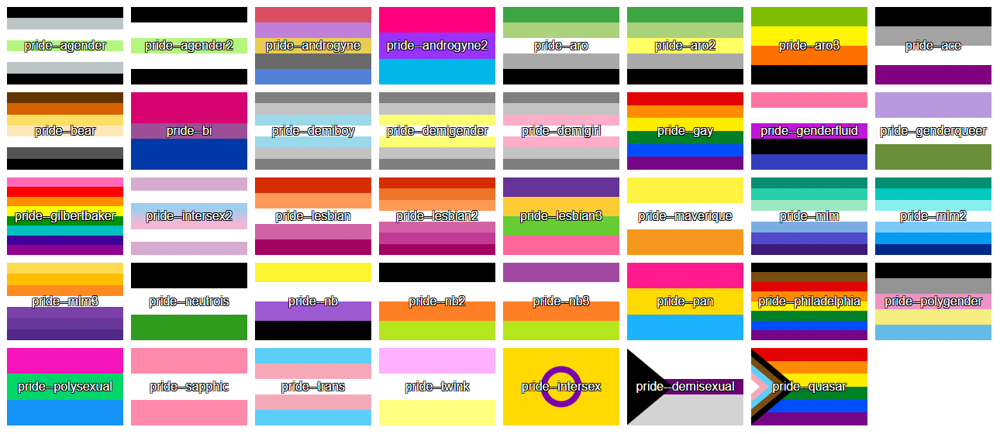

## PrideCSS, a BEM-compliant SCSS library for adding pride flags

[](https://github.com/VKEA/PrideCSS/blob/master/LICENSE)
[](https://github.com/VKEA/PrideCSS/issues)
[](https://travis-ci.com/VKEA/PrideCSS)
[](https://www.codacy.com/gh/VKEA/PrideCSS/dashboard?utm_source=github.com&amp;utm_medium=referral&amp;utm_content=VKEA/PrideCSS&amp;utm_campaign=Badge_Grade)
[](https://snyk.io/test/github/VKEA/PrideCSS?targetFile=package.json)

PrideCSS is a SCSS library for adding pride flags to your HTML elements.

SCSS source can be found in the `scss`folder, compiled CSS can be found inside the`css` folder.



## Installation

npm

```
npm i @vkea/pridecss
```

yarn

```
yarn add @vkea/pridecss
```

jsdelivr - pride.css

```
<link rel="stylesheet" href="https://cdn.jsdelivr.net/npm/@vkea/pridecss@3.4.0/css/pride.css">
```

jsdelivr - pride-lite.css

```
<link rel="stylesheet" href="https://cdn.jsdelivr.net/npm/@vkea/pridecss@3.4.0/css/pride-lite.css">
```

unpkg - pride.css

```
<link rel="stylesheet" href="https://unpkg.com/@vkea/pridecss@3.4.0/css/pride.css">
```

unpkg - pride-lite.css

```
<link rel="stylesheet" href="https://unpkg.com/@vkea/pridecss@3.4.0/css/pride-lite.css">
```


## Usage

PrideCSS comes in two flavours: a full version and a light version. If you don't need to use directional modifiers for your flags, it is recommended to use the light version `pride-lite`, which contains all different pride flags, but without directional modifiers.

PrideCSS class names start with the word `pride`, followed by Block Element Modifier (BEM) modifiers.

Example

```html
<div class="pride--nb"></div>
```

You can use different modifiers like `horizontal`, `radial` or `bottomleft` to specify the direction of the pride gradient.

Examples

```html
<div class="pride--radial--lesbian"></div>
<div class="pride--horizontal--gay"></div>
<div class="pride--topright--ace"></div>
```

## Modifiers

### Pride flags

| Flag           | Type     |
|----------------|---------:|
| agender        | standard |
| agender2       | standard |
| androgyne      | standard |
| androgyne2     | standard |
| aro            | standard |
| aro2           | standard |
| aro3           | standard |
| aroace         | standard |
| ace            | standard |
| ace2           | standard |
| bear           | standard |
| bi             | standard |
| demiboy        | standard |
| demigender     | standard |
| demigirl       | standard |
| demisexual     | complex  |
| gay            | standard |
| genderfluid    | standard |
| genderqueer    | standard |
| gilbertbaker   | standard |
| intersex       | radial   |
| intersex2      | standard |
| lesbian        | standard |
| lesbian2       | standard |
| lesbian3       | standard |
| maverique      | standard |
| mlm            | standard |
| mlm2           | standard |
| mlm3           | standard |
| neutrois       | standard |
| nb             | standard |
| nb2            | standard |
| nb3            | standard |
| omnisexual     | standard |
| pan            | standard |
| philadelphia   | standard |
| polygender     | standard |
| polysexual     | standard |
| quasar         | complex  |
| sapphic        | standard |
| trans          | standard |
| twink          | standard |

### Gradient directions
| Direction                   | Compatibility             |
|-----------------------------|--------------------------:|
| {name}                      | standard, radial, complex |
| horizontal--{name}          | standard                  |
| topleft--{name}             | standard                  |
| topright--{name}            | standard                  |
| bottomright--{name}         | standard                  |
| bottomleft--{name}          | standard                  |
| radial--{name}              | standard, radial          |
| radial--top--{name}         | standard, radial          |
| radial--bottom--{name}      | standard, radial          |
| radial--left--{name}        | standard, radial          |
| radial--right--{name}       | standard, radial          |
| radial--topleft--{name}     | standard, radial          |
| radial--topright--{name}    | standard, radial          |
| radial--bottomright--{name} | standard, radial          |
| radial--bottomleft--{name}  | standard, radial          |
| border--thin--{name}        | standard                  |
| border--thin--{name}        | standard                  |
| border--thick--{name}       | standard                  |
| border--dummythicc--{name}  | standard                  |

## Contributing

Flags and CSS generation are split. `scss/flags` is where the flags are defined, `scss/logic` is where the CSS generation logic is, `pride.scss` and `pride-lite.scss` are output files.

Run `npm i` to install Grunt, SCSS and Stylelint packages.

If you have the Grunt CLI, you can run `grunt`, which automatically compiles and lints your changes.
